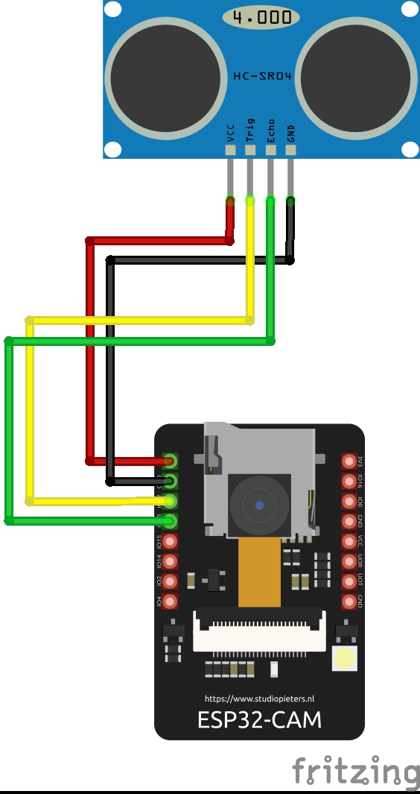
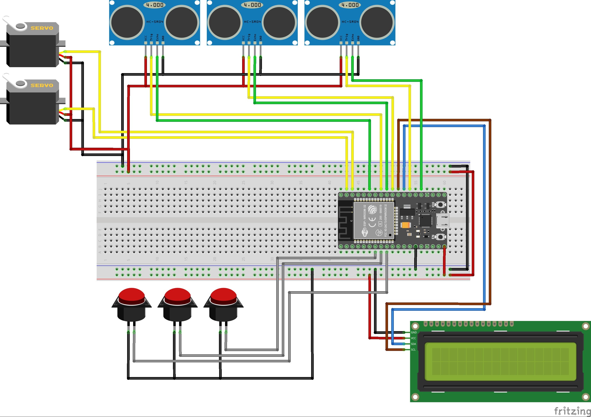

# SortMate
## Our Objective
Our main objective is to design and build an AI-based smart bin that can detect the type of waste placed on it, sort it into the correct bin automatically, and notify the relevant staff when the bin is full.

---

## System Overview

| Module | Component | Description |
|------------|-----------|-----------|
| Image Capture and Sorting Module | ESP32-CAM Module | Capture images of the items and further image processing |
| Servo Motor Module | MG90s 9g Servo Motors | Rotate and tilt platform toward the correct bin |
| Sensor Module | HC-SR04 Ultrasonic Sensors | Measure waste levels inside bins |
| Core Module | ESP32S Module – 30PIN | Process data from the ESP32-CAM and control other modules |
| Display Module | 16x2 LCD Display | Communicates with the user |

---

## Features
- Real-time waste classification using TensorFlow
- Dual ESP32 architecture for distributed control
- Automated Sorting detects and sorts waste automatically
- Scalable and reprogrammable design for adding new waste types

---

## Tech Stack
- **Hardware:** ESP32-CAM, ESP32, Servo Motors, Ultrasonic Sensor, LCD Display
- **Software:** TensorFlow, Arduino IDE, Python, Flask
---

## How It Works

The smart waste sorting system uses an ESP32-CAM with an HC-SR04 ultrasonic sensor to detect objects at 4-25 cm. Upon trigger, the OV2640 camera captures VGA JPEG frames, encodes them to base64 MIME-prefixed strings, and POSTs as JSON to a Flask server via WiFi. The Python 3 server employs TensorFlow/Keras and OpenCV to detect and return class and confidence of the captured image.

On the ESP32-CAM, sends the class via ESP-NOW. The receiver ESP32 (WiFi STA + ESP-NOW) handles data in OnDataRecv, mapping to two servo motors physically tilts/rotates the bin to drop the item into the correct compartment.. It displays on LCD, monitors bins with three HC-SR04 and show the bin fill level as a percentage, also provides a web based dashboard for monitoring and manual control.

 
